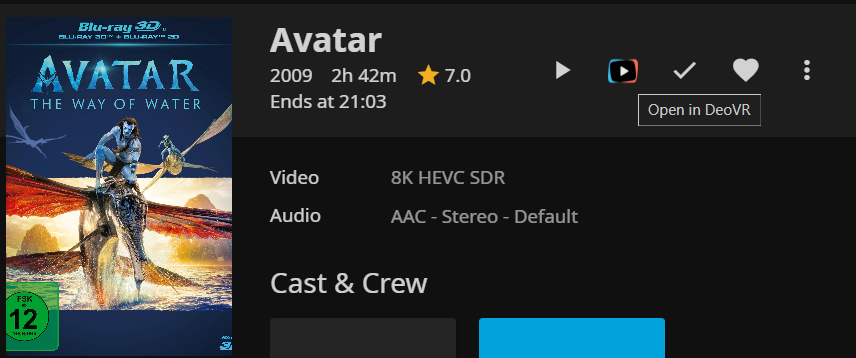

# DeoVR Deeplink Proxy Plugin for Jellyfin

> [!CAUTION]
> Configure <b>IP Restrictions</b> in Plugin settings if your Jellyfin server is public or in an untrusted network!

A plugin for Jellyfin that adds (partial) support with [DeoVR](https://deovr.com/app)
Allows direct browsing when you open jellyfin with DeoVR.

## Features

- **DeoVR Browsing** Browse your Libraries in DeoVR
- **Video scrubbing in DeoVR** Optionally generate timeline images to allow video scrubbing (optional)
- **UI Changes:** adds a 'Play in DeoVR' button
- **Secure signed links:** Temporary, HMAC-signed links for proxying video streams.
- **DeoVR-compatible JSON responses:** Works seamlessly with [DeoVR](https://deovr.com/app/doc).

## Preview



---

## Getting Started

### Prerequisites

- [Jellyfin Media Server](https://jellyfin.org/) with a valid https certificate
- DeoVR for testing client integration (optional)

## Installation ##

### Jellyfin Web Client (Server) ###
1. Add the manifest `https://raw.githubusercontent.com/toastyice/DeoVRDeeplink/master/manifest.json` as a Jellyfin plugin repository to your server.
2. Install the plugin `DeoVRDeeplink` from the repository.
3. Restart the Jellyfin server.

### Configuration

In the Jellyfin dashboard (**Dashboard → Plugins → DeoVRDeeplink**), you can configure:
- **IP Restriction:** Restrict access to DeoVR endpoints based on allowed CIDR IP ranges.
- **Library Settings:**
  - **Enabled:** Enable or disable DeoVR browsing for the library.
  - **Sort By / Sort Order:** Configure library sorting in DeoVR.
  - **Timeline Images:** Generate thumbnail scrubs for video seeking.
  - **Forced Projection / Forced Stereo Mode:** Force all videos in this library to use a specific projection or stereo mode, overriding filename detection (ideal for dedicated VR180 or 3D movie libraries).
  - **Fallback Projection / Fallback Stereo Mode:** Default projection and stereo mode to use when a video has no tags, filename markers, or 3D metadata.

---

## Video Format Detection & VR Naming Guide

DeoVRDeeplink includes a smart format detector to automatically distinguish between traditional flat 3D movies, VR equirectangular projections (180°/360°), fisheye cameras, and standard 2D videos.

### Detection Priority Hierarchy
Formats are resolved in the following order (**Configuration Priority**):
1. **Item Tags (Highest Priority):** Explicit tags set on the item in Jellyfin.
2. **Library Forced Settings:** Forced projection/stereo mode configured for the library in plugin settings.
3. **Filename Conventions:** Automatically parsed from the video filename.
4. **Jellyfin Scanned 3D Metadata:** Native `Video3DFormat` (e.g., standard `.3D.hsbs` cinema releases default to a flat 3D screen).
5. **Library Fallback Settings:** Fallback projection/stereo configured in plugin settings.
6. **Global Default:** Standard 2D flat video (`screenType: flat`, `stereoMode: off`, `is3d: false`).

---

### Option 1: Filename Naming (Recommended for Easy Setup)
Simply include standard tags anywhere in your filename. Tags are **case-insensitive** and can appear in any order, separated by `_`, `-`, `.`, spaces, or brackets.

#### 1. Projection / Screen Types
| DeoVR Projection | Format Description | Supported Filename Tags |
| :--- | :--- | :--- |
| `flat` | Standard 2D or Cinema 3D screen | `flat`, `cinema`, `flat3d`, or Jellyfin `.3D.` (without VR tags) |
| `dome` | 180° Equirectangular (VR180) | `_180`, `180`, `vr180`, `180vr` |
| `sphere` | 360° Equirectangular (VR360) | `_360`, `360`, `vr360`, `360vr` |
| `fisheye` | 180° / 220° Fisheye | `_fisheye`, `fisheye`, `fisheye180`, `vrca220` |
| `rf52` | 190° Fisheye (Canon RF 5.2mm lens) | `_fisheye190`, `fisheye190`, `rf52`, `_rf52` |
| `mkx200` | 200° MKX Fisheye lens | `_mkx200`, `mkx200`, `fisheye200`, `_fisheye200` |

> [!NOTE]
> Filename parsing uses strict boundaries, so resolution tags like `1080p`, `2160p`, or `360p` will **not** trigger false matches for `180` or `360`.

#### 2. Stereo Layouts
| Stereo Mode | Description | Supported Filename Tags |
| :--- | :--- | :--- |
| `sbs` | Side-by-Side 3D (Left/Right) | `sbs`, `hsbs`, `fsbs`, `lr`, `3dh`, `sidebyside`, `side-by-side`, `half-sbs`, `full-sbs` |
| `tb` | Top-and-Bottom 3D (Over/Under) | `tb`, `htab`, `ftab`, `ou`, `3dv`, `overunder`, `topbottom`, `half-ou`, `full-ou` |
| `cuv` | Custom UV layout (raw Canon RF5.2 dual feed) | `cuv` |
| `off` | Monoscopic 2D / Mono VR | `2d`, `mono`, `monoscopic` |

#### 3. Filename Examples
- `VR_Video_SBS_180.mp4` → 180° Dome, Side-by-Side 3D
- `Nature_360_TB.mp4` → 360° Sphere, Top-Bottom 3D
- `Space360_Mono.mp4` → 360° Sphere, Monoscopic 2D
- `Rollercoaster_SBS_fisheye.mp4` → 180° Fisheye, Side-by-Side 3D
- `My_video_SBS_mkx200.mp4` → 200° MKX Fisheye, Side-by-Side 3D
- `Sample_RF52_SBS.mp4` → 190° Canon RF5.2mm Fisheye, Side-by-Side 3D
- `Avatar (2009).3D.HSBS.1080p.mkv` → Flat 3D Cinema Screen (Left/Right 3D, not warped into a sphere!)
- `Titanic (1997).3D.HTAB.1080p.mkv` → Flat 3D Cinema Screen (Top/Bottom 3D)
- `Inception (2010) 1080p.mkv` → Standard Flat 2D Movie

---

### Option 2: Jellyfin Metadata Tags (Configuration Override)
If you cannot rename files (e.g. for torrent seeding or strict scraping tools), you can configure formats directly in Jellyfin:

1. In the Jellyfin web client, click **`...` (More Options)** on the video card and select **Edit Metadata**.
2. Scroll to the **Tags** field and add the desired tags:
   - **Projection tags:** `VR180` (or `dome`), `VR360` (or `sphere`), `Fisheye`, `Fisheye190` (or `RF52`), `MKX200`, `Flat`
   - **Stereo tags:** `SBS`, `TB`, `2D` (or `Mono`), `CUV`
   - **Namespaced tags (optional):** `deovr:dome`, `deovr:sphere`, `deovr:fisheye`, `deovr:rf52`, `deovr:mkx200`, `deovr:sbs`, `deovr:tb`, `deovr:off`
3. Click **Save**.

Metadata tags take precedence over filename detection.

---

### Option 3: Dedicated Library Configuration
If you organize your media into dedicated libraries (e.g., a "VR 180" library or a "3D Movies" library):
1. Go to **Dashboard → Plugins → DeoVRDeeplink**.
2. Find the library and set **Forced Projection** and/or **Forced Stereo Mode**.
3. All videos in that library will automatically play with the specified format without needing renaming or tagging.

---

### Usage

1. **DeoVR Integration:**  
    Simply open DeoVR and enter your Jellyfin URL
    OR
    Click 'Open in DeoVR' Button

## Security

- Streams are protected with expiring, HMAC-signed tokens.
- Links cannot be forged or reused after expiry.
- Secret is never sent to the client.
- The expiry time is twice the length of the film.
- Optional IP restrictions on all routes expect script and icon

---

## Advanced

- **endpoints:**
  - `/deovr`
  - `/deovr/ClientScript`
  - `/deovr/Icon`
  - `/deovr/json/{MovieUUID}/response.json`
  - `/deovr/proxy/{MovieUUID}/{mediaSourceId}/{Expiry}/{Signature}/stream.mp4`
  - `/deovr/timeline/{MovieUUID}/4096_timelinePreview341x195.jpg`

---

## Development

- Fork and clone this repository.
- Build with your preferred .NET IDE or `dotnet` CLI.
- Contributions and PRs welcome!

---

## Troubleshooting ##

### 1. The button isn't visible ###
This is most likely related to wrong permissions for the `index.html` file.

#### 1.1 Change Ownership inside a docker container ####

If you're running jellyfin in a docker container, you can change the ownership with thie following command
(replace jellyfin with your containername, user and group with the user and group of your container):

```bash
docker exec -it --user root jellyfin chown user:group /jellyfin/jellyfin-web/index.html && docker restart jellyfin
```

You can run this as a cron job on system startup.

(Thanks to [muisje](https://github.com/muisje) for helping with [this](https://github.com/Namo2/InPlayerEpisodePreview/issues/49#issue-2825745530) solution)

#### 1.2 Change Ownership running on a Windows installation ####
1. Navigate to: `C:\Program Files\Jellyfin\Server\jellyfin-web\`
2. Right-click on `index.html` → `Properties` → `Security tab` → Click on `Edit`
3. Select your user from the list and check the Write `permission` box.
4. Restart both the server and client.

(Thanks to [xeuc](https://github.com/xeuc) for [this](https://github.com/Namo2/InPlayerEpisodePreview/issues/49#issuecomment-2746136069) solution)

If this does not work, please follow the discussion in [this](https://github.com/Namo2/InPlayerEpisodePreview/issues/10) (or [this](https://github.com/Namo2/InPlayerEpisodePreview/issues/49)) issue.

### 2. The Film doesn't start/load in DeoVR ###

Make sure that your Jellyfin server is configured to use HTTPS and that it has a valid certificate.
If you are using a reverse proxy, check that everything is set up correctly.

<br/>
If you encounter any error which you can't solve yourself, feel free to open up an issue.
<br/>Please keep in mind that any system is different which can lead to unexpected behaviour, so add as much information about it as possible.
<br/>Jellyfin logs and console logs from the browser (prefixed as [InPlayerEpisodePreview]) are always useful.

---

## Credits
- This plugin was inspired by a lack of a proper VR player that supports Jellyfin
- [Jellyfin Media Server](https://jellyfin.org/)
- [DeoVR](https://deovr.com/)
- [InPlayerEpisodePreview (Heavily inspired the way the UI is edited)](https://github.com/Namo2/InPlayerEpisodePreview)
---

**Happy streaming!**
